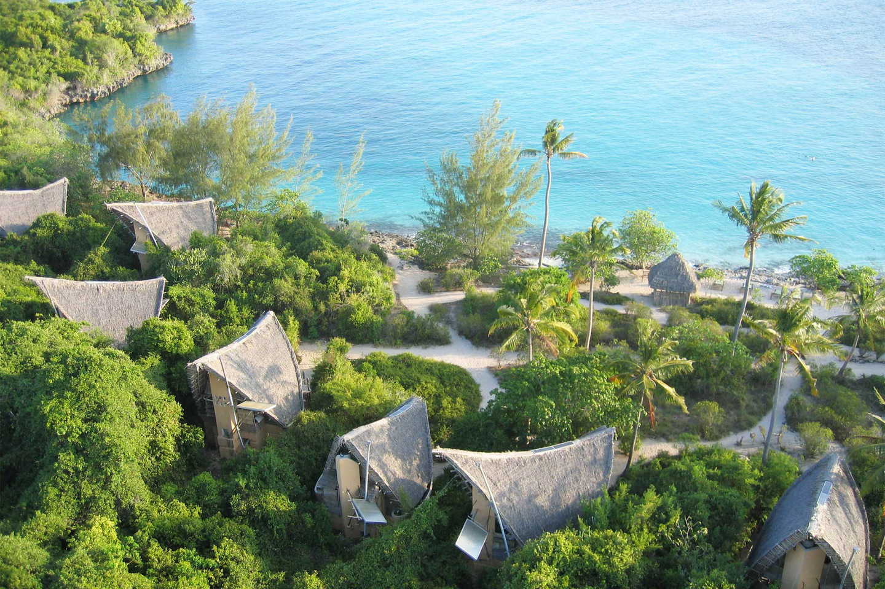
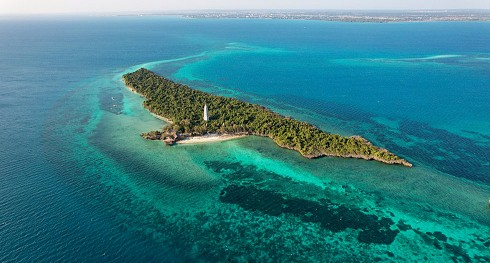

<!-- section 1 (JP) -->



# Chumbe Island

### World-leading Ecotourism Destination

Chumbe Island in the Zanzibar archipelago has been a private nature reserve for more than 25 years, protecting a diverse array of life on land and amid its surrounding coral reef sanctuary.

Trips to Chumbe Island leave from our property each day.

<button>[Website](https://chumbeisland.com/)</button>

 
 
 
 
 
 



<!-- section 1 (JP) -->



|||

6 km south of Stone Town, surrounded by pristine coral reefs, Chumbe Island Coral Park is one of the world's most successful ecotourism projects. In 1994 the reef surrounding Chumbe island was created as Tanzania's first Marine National Park.

Chumbe Island Coral Park won the British Airways Tourism for Tomorrow Award in 1999, in recognition of seven years of conservation work carried out in cooperation with local fishermen, now retrained as marine wardens.



<!-- section 2 (JP) -->



Visitors can come for the day to snorkel over the incredible coral reef, which contains over 90% of all coral species ever recorded in East Africa. The reef, declared the 'world's best shallow water coral reef' by the Australian Institute of Marine Science, is home to over 370 species of fish, turtles, and dolphins.

But to experience Chumbe Island properly, stay the night in one of the seven 'eco-bandas' that nestle in the forest. Each is a two-story, private cottage constructed out of local materials and decorated with shells, driftwood, and colorful local fabrics.

|||



<!-- section 2 (JP) -->



|||

Water and energy on Chumbe are self-sustaining and provided by nature - the roofs of the bandas and the education center have been designed to catch and filter rainwater, which is then heated by solar power.

All profits from tourism on Chumbe Island are reinvested into the conservation and education programs operating in the Park, and the island is staffed and managed by local Zanzibaris from the fishing community, with voluntary support from overseas experts.

